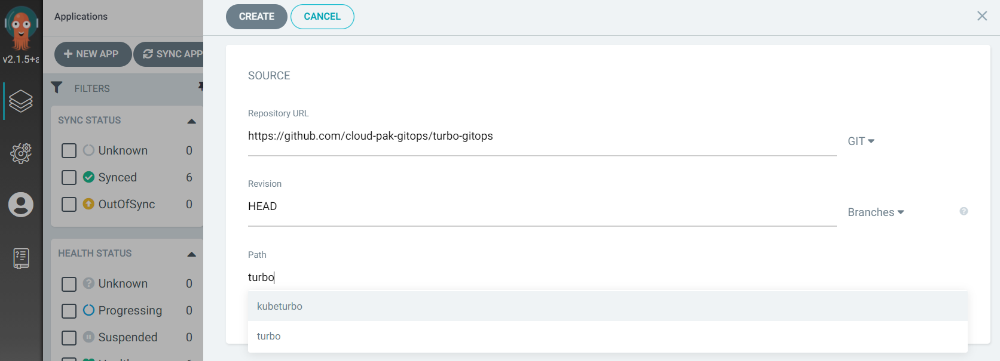

# Deploying Turbonomic with GitOps

## Prerequisite for deploying Turbonomic to OpenShift Cluster
- OpenShift 4.6+
- Argocd
- Resource requirement, please refer to the [Turbonomic Installation Guide](https://docs.turbonomic.com/docApp/doc/index.html?config=Install_Pnt#!/Latest_Install/_INSTALL_Topics_XL/TOPIC_Minimum_Requirements_XL.xml).

## Deploying with GitOps command line

### Create target namespace and configure security context for the target Cluster.
```shell
oc create ns turbonomic
oc adm policy add-scc-to-group anyuid system:serviceaccounts:turbonomic
```

### Login to Argo CD Cli
```shell
argocd login https://<argocd-hostname>:<port> --username admin
Password:
```

### Create Argocd app to deploy Turbonomic
```shell
argocd app create turbo --repo https://github.com/cloud-pak-gitops/turbo-gitops.git \
  --path turbo \
  --dest-namespace turbonomic \
  --dest-server <ARGO_CLUSTER> \
  --helm-set metadata.registryUsername=<DOCKER_USER> \
  --helm-set metadata.registryPassword=<DOCKER_TOKEN> \
  --sync-policy automated
```

### Create routes for Turbonomic
```shell
   oc -n turbonomic create route passthrough --service nginx --port=https-nginx
   oc -n turbonomic expose service topology-processor --port=grpc-topology-processor
   oc -n turbonomic expose service api --port=https-api
```

## Deploying with GitOps through Argocd Console

### From Applications select +NEW APP

#### GENERAL section
input desired Application Name and select a Project.


#### SOURCE section, input
`https://github.com/cloud-pak-gitops/turbo-gitops` for Repository URL.
`HEAD` for Revision.
Select `turbo` from Path drop down menu.


#### DESTINATION section
Select the desired Cluster URL from the drop down menu.
Input the target Namespace.


##### HELM section
need to provide the docker credential for pulling docker images.
Docker Username for `metadata.registryUsername`
Docker Token for `metadata.registryPassword`
  
  
Then click CREATE to complete.


