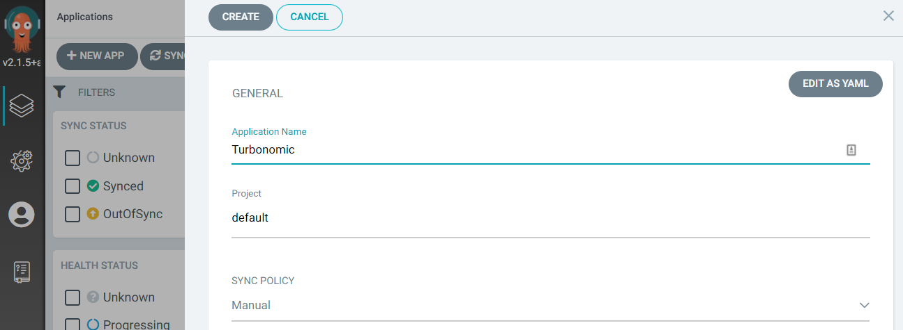
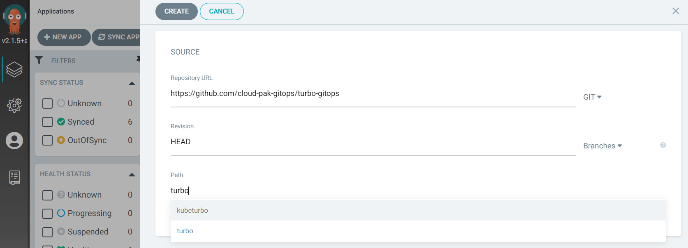
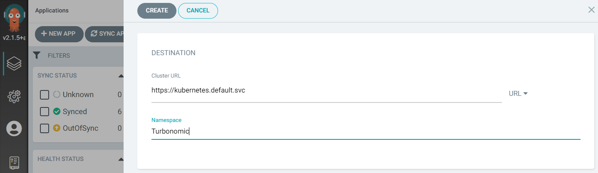
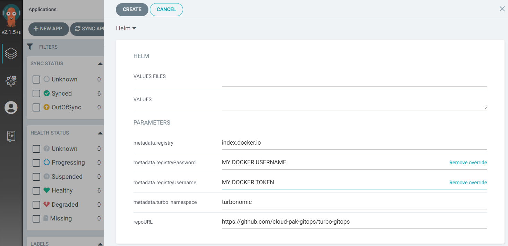

<!-- START doctoc generated TOC please keep comment here to allow auto update -->
<!-- DON'T EDIT THIS SECTION, INSTEAD RE-RUN doctoc TO UPDATE -->
**Table of Contents**  

- [Deploying Turbonomic(server) with GitOps](#deploying-turbonomicserver-with-gitops)
  - [Prerequisite for deploying Turbonomic to OpenShift Cluster](#prerequisite-for-deploying-turbonomic-to-openshift-cluster)
  - [Deploying Turbonomic with GitOps CLI](#deploying-turbonomic-with-gitops-cli)
    - [Create target namespace and configure security context for the target Cluster.](#create-target-namespace-and-configure-security-context-for-the-target-cluster)
    - [Login to Argo CD Cli](#login-to-argo-cd-cli)
    - [Create Argocd app to deploy Turbonomic](#create-argocd-app-to-deploy-turbonomic)
    - [Create routes for Turbonomic](#create-routes-for-turbonomic)
    - [Access Turbonomic Console](#access-turbonomic-console)
  - [Deploying Turbonomic(server) with GitOps via GUI Console](#deploying-turbonomicserver-with-gitops-via-gui-console)
    - [From Applications select +NEW APP](#from-applications-select-new-app)
      - [GENERAL section](#general-section)
      - [SOURCE section](#source-section)
      - [DESTINATION section](#destination-section)
      - [HELM section](#helm-section)
    - [Verify Deployment Result](#verify-deployment-result)
- [Deploying Kubeturbo(kube agent) with GitOps](#deploying-kubeturbokube-agent-with-gitops)

<!-- END doctoc generated TOC please keep comment here to allow auto update -->

# Deploying Turbonomic(server) with GitOps

## Prerequisite for deploying Turbonomic to OpenShift Cluster
- OpenShift 4.6+
- Argocd
- Resource requirement, please refer to the [Turbonomic Installation Guide](https://docs.turbonomic.com/docApp/doc/index.html?config=Install_Pnt#!/Latest_Install/_INSTALL_Topics_XL/TOPIC_Minimum_Requirements_XL.xml).

## Deploying Turbonomic with GitOps CLI

### Create target namespace and configure security context for the target Cluster.
This is only required for Openshift OCP cluster.  

```shell
oc create ns turbonomic
oc adm policy add-scc-to-group anyuid system:serviceaccounts:turbonomic
```

### Login to Argo CD Cli
```shell
argocd login <argocd-hostname>:<port> --username admin
Password:
```

### Create Argocd app to deploy Turbonomic
```shell
argocd app create turbo --repo https://github.com/cloud-pak-gitops/turbo-gitops.git \
  --path turbo \
  --dest-namespace turbonomic \
  --dest-server <ARGO_CLUSTER> \
  --helm-set metadata.registryUsername=<DOCKER_USER> \
  --helm-set metadata.registryPassword=<DOCKER_TOKEN> \
  --sync-policy automated
```

### Create routes for Turbonomic
```shell
   oc -n turbonomic create route passthrough --service nginx --port=https-nginx
   oc -n turbonomic expose service topology-processor --port=grpc-topology-processor
   oc -n turbonomic expose service api --port=https-api
```

### Access Turbonomic Console
Get the Console URL from below command, the URL will be lised under `HOST/PORT`, use `https://<URL>` to accecc the console.  

```shell
oc get route nginx -n turbonomic
```


## Deploying Turbonomic(server) with GitOps via GUI Console

### From Applications select +NEW APP

#### GENERAL section
input desired Application Name and select a Project.


#### SOURCE section
- Input `https://github.com/cloud-pak-gitops/turbo-gitops` for Repository URL.  
- Select `HEAD` for Revision.  
- Select `turbo` from Path drop down menu.  



#### DESTINATION section
- Select the desired Cluster URL from the drop down menu.  
- Input the target Namespace `turbonomic`.  



#### HELM section
- Need to provide the docker credential for pulling docker images.  
- Input Docker Username for `metadata.registryUsername`  
- Input Docker Token for `metadata.registryPassword`   

  
    
Then click CREATE to complete.

### Verify Deployment Result
- [Verify Deployment via CLI](Gitops-verify-deployment.md#verify-deployment-via-cli)
- [Verify Deployment via GUI](Gitops-verify-deployment.md#verify-deployment-via-gui)

# Deploying Kubeturbo(kube agent) with GitOps
- [Deploy Kubeturbo via GitOps CLI](Gitops-kubeturbo-Install.md#deploying-kubeturbokube-agent-with-gitops-cli)
- [Deploy Kubeturbo via GitOps GUI console](Gitops-kubeturbo-Install.md#deploying-kubeturbokube-agent-with-gitops-via-gui-console)
