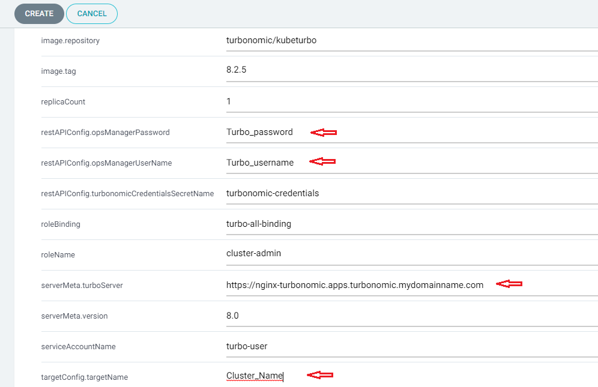

<!-- START doctoc generated TOC please keep comment here to allow auto update -->
<!-- DON'T EDIT THIS SECTION, INSTEAD RE-RUN doctoc TO UPDATE -->
**Table of Contents**  

- [Deploying Kubeturbo(kube agent) with GitOps](#deploying-kubeturbokube-agent-with-gitops)
  - [Prerequisite for deploying Kubeturbo to OpenShift Cluster](#prerequisite-for-deploying-kubeturbo-to-openshift-cluster)
  - [Deploying Kubeturbo(kube agent) with GitOps CLI](#deploying-kubeturbokube-agent-with-gitops-cli)
    - [Login to Argo CD Cli](#login-to-argo-cd-cli)
    - [Create Argocd app to deploy Kubeturbo](#create-argocd-app-to-deploy-kubeturbo)
  - [Deploying Kubeturbo(kube agent) with GitOps via GUI Console](#deploying-kubeturbokube-agent-with-gitops-via-gui-console)
    - [Navigate to Manage Application in Argocd Console, click +NEW APP.](#navigate-to-manage-application-in-argocd-console-click-new-app)
      - [GENERAL section](#general-section)
      - [SOURCE section](#source-section)
      - [DESTINATION section](#destination-section)
      - [HELM section](#helm-section)
    - [Verify Deployment Result](#verify-deployment-result)

<!-- END doctoc generated TOC please keep comment here to allow auto update -->

# Deploying Kubeturbo(kube agent) with GitOps

Before Kubeturbo deployment, some Turbonomic(server) informations will be needed:  
- Turbonomic server URL
- Turbonomic server username
- Turbonomic server password

## Prerequisite for deploying Kubeturbo to OpenShift Cluster
- Turbonomic(server)
- Argocd(target cluster managed by Argocd)
- Resource requirement, please refer to the [Turbonomic Installation Guide](https://docs.turbonomic.com/docApp/doc/index.html?config=Install_Pnt#!/Latest_Install/_INSTALL_Topics_XL/TOPIC_Minimum_Requirements_XL.xml).

## Deploying Kubeturbo(kube agent) with GitOps CLI

### Login to Argo CD Cli
```shell
argocd login <argocd-hostname>:<port> --username admin
Password:
```

### Create Argocd app to deploy Kubeturbo
```shell
argocd app create kubeturbo --repo https://github.com/cloud-pak-gitops/turbo-gitops.git \
  --path kubeturbo \
  --dest-namespace turbo \
  --dest-server <ARGO_CLUSTER> \
  --helm-set targetConfig.targetName=<AGENT CLUSTER NAME> \
  --helm-set serverMeta.turboServer=<TURBONOMIC SERVER URL> \
  --helm-set restAPIConfig.opsManagerUserName=<TURBO USER> \
  --helm-set restAPIConfig.opsManagerPassword=<TURBO PASSWORD> \
  --sync-policy automated
```

## Deploying Kubeturbo(kube agent) with GitOps via GUI Console

### Navigate to Manage Application in Argocd Console, click +NEW APP.

#### GENERAL section
input desired Application Name and select a Project.  


#### SOURCE section
- Input `https://github.com/cloud-pak-gitops/turbo-gitops` for Repository URL.  
- Select `HEAD` for Revision.  
- Select `kubeturbo` from Path drop down menu.  


#### DESTINATION section
- Select the desired Cluster URL from the drop down menu.  
- Input the target Namespace `turbo`.  


#### HELM section
Need to provide the docker credential for pulling docker images.  
- Input Turbonomic console URL for `serverMeta.turboServer`    
- Input Turbonomic login username for `restAPIConfig.opsManagerUserName`    
- Input Turbonomic login password for `restAPIConfig.opsManagerPassword`   
- Input desired Cluster Name for `targetConfig.targetName`  

  
    
Then click CREATE to complete.

### Verify Deployment Result
- [Verify Deployment via CLI](Gitops-verify-deployment.md#verify-deployment-via-cli)
- [Verify Deployment via GUI](Gitops-verify-deployment.md#verify-deployment-via-gui)
