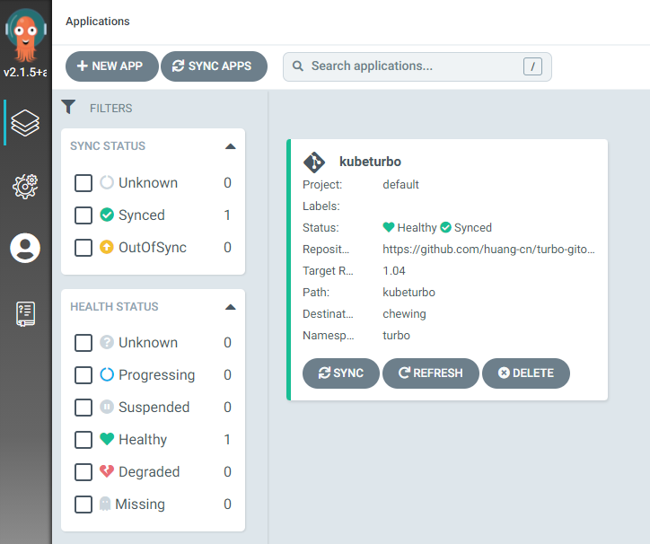

## Verify Deployment Result

### Verify Deployment via CLI
```shell
argocd app list 
```

```
NAME         CLUSTER                         NAMESPACE  PROJECT  STATUS  HEALTH   SYNCPOLICY  CONDITIONS  REPO                                                      PATH          TARGET
kubeturbo    https://kubernetes.default.svc  turbo      default  Synced  Healthy  Auto        <none>      https://github.com/cloud-pak-gitops/turbo-gitops.git      kubeturbo
```

```shell
argocd get app kubeturbo
```

```
Name:               kubeturbo
Project:            default
Server:             https://kubernetes.default.svc
Namespace:          turbo
URL:                https://mydomain.ibm.com:9443/applications/kubeturbo
Repo:               https://github.com/cloud-pak-gitops/turbo-gitops.git
Target:
Path:               kubeturbo
SyncWindow:         Sync Allowed
Sync Policy:        Automated
Sync Status:        Synced to  (1b9863e)
Health Status:      Healthy

GROUP                      KIND                NAMESPACE  NAME                    STATUS   HEALTH  HOOK  MESSAGE
                           ServiceAccount      turbo      turbo-user              Synced                 serviceaccount/turbo-user created
                           ConfigMap           turbo      turbo-config-kubeturbo  Synced                 configmap/turbo-config-kubeturbo created
rbac.authorization.k8s.io  ClusterRoleBinding  turbo      turbo-all-binding       Synced                 clusterrolebinding.rbac.authorization.k8s.io/turbo-all-binding reconciled. reconciliation required create
apps                       Deployment          turbo      kubeturbo               Synced  Healthy        deployment.apps/kubeturbo created
rbac.authorization.k8s.io  ClusterRoleBinding             turbo-all-binding       Synced
```

### Verify Deployment via GUI

From Argocd Console, navigate to Manage Application, there should be app showing up, and the Status showing Healthy and Synced with Green icons.  


