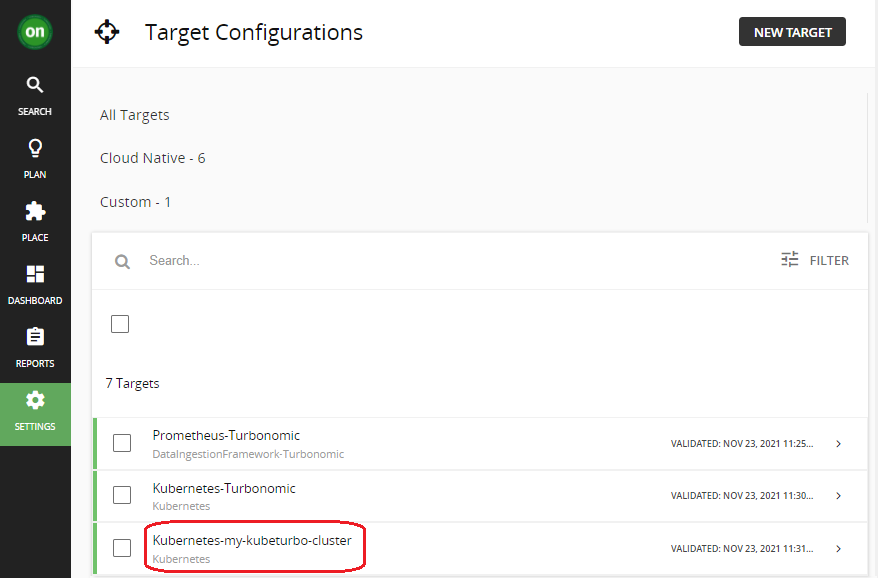

# Verify from Turbonomic Console

## Checking kubeturbo from Tubonomic Console
- Navigate to Turbonomic Target configurations under SETTINGS  
  

- Under All Targets Tab, after kubeturbo installed, the corresponding Cluster Name should be showing up in the list.  
The target name should be `Kubernetes` prefix + [AGENT CLUSTER NAME](Gitops-kubeturbo-Install.md#create-argocd-app-to-deploy-kubeturbo)

